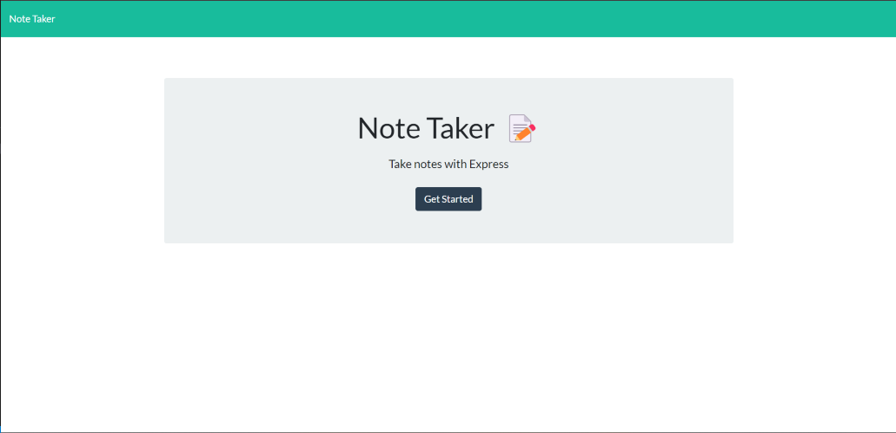
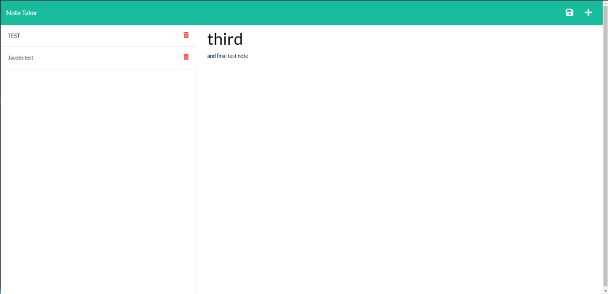

# Challenge 11 - miniature-robot


## Note Taker

---

### Contents 

---

1. Objectives
2. About
3. Screenshots
4. Links
5. Assignment details & grading rubric (*ignore me*)

<br>
<br>

### Objectives ###

---

<br>

1. WHEN a user opens the Note Taker, they are presented with a landing page with a link to a notes page.
2. WHEN the link to the notes page is clicked, the user is presented with a page with existing notes listed in the left-hand column, plus empty fields to enter a new note title and the note’s text in the right-hand column.
3. WHEN a new note title and the note’s text are entered, THEN a Save icon appears in the navigation at the top of the page.
4. WHEN the Save icon is clicked, THEN the new note is saved and appears in the left-hand column with the other existing notes.
5. WHEN an existing note is clicked in the list in the left-hand column. THEN that note appears in the right-hand column.
6. WHEN a user clicks on the Write icon in the navigation at the top of the page, THEN they are presented with empty fields to enter a new note title and the note’s text in the right-hand column.

<br>
<br>

### About ###

---

<br>

1. WHEN a user opens the Note Taker, they are presented with a landing page with a link to a notes page.
    > When the app is opened, the user is presented with a landing page that allows the user to click a 'Get Started' button. Clicking this button takes the user to the actual notes page where they may take notes.

<br>

2. WHEN the link to the notes page is clicked, the user is presented with a page with existing notes listed in the left-hand column, plus empty fields to enter a new note title and the note’s text in the right-hand column.
    > Once the 'Get Started' button is clicked, the user is taken to the notes page where they are able to write notes and save them. The left hand column shows saved notes and the right column si the active note field where the user can edit and create notes. 

<br>

3. WHEN a new note title and the note’s text are entered, THEN a Save icon appears in the navigation at the top of the page.
    > Once a user enters a title and a note body, a 'keyup' event is triggered that calls the function to render the save icon in the top right hand corner of the page.
<br>

4. WHEN the Save icon is clicked, THEN the new note is saved and appears in the left-hand column with the other existing notes.
    > Once the save icon is clicked a post request is sent to the api/notes page where the file db.json is accessed. Once accessed the current data in db.json is read, the newly constructed note object is pushed into the array of existing notes objects. After the new notes objec tis pushed into the array, the db.json file is then re-written using the new array including the newly saved notes objects. During the process each note is given a 4 digit uuid.

<br>

5. WHEN an existing note is clicked in the list in the left-hand column. THEN that note appears in the right-hand column.
    >  Each note id given a uuid that is used to check to see if one is present. If present the note is populated in the right column and is set to read-only. If not present then an empty note is placed in the right hand column to alow the user to write a new note. Future iterations could remove the read-only functionality to allow users to edit existing notes.
<br>

6. WHEN a user clicks on the Write icon in the navigation at the top of the page, THEN they are presented with empty fields to enter a new note title and the note’s text in the right-hand column.
	> Once the write icon (signified by a plus sign) is clicked, the right hand column is emptied and the user may enter a new note. When viewing an existing note, if th euser wishes to write  new note they mush click this icon as the currently displayed note will be read-only.
<br>
<br>

### Screenshots ###

---

<br>



<br>



<br>

### Links ###

---

<br>


Link to Github repo: https://github.com/JDReeves86/miniature-robot

Link to deployed app on Heroku: https://pacific-island-12555.herokuapp.com/


<br>
<br>
<br>
<br>
<br>
<br>
<br>
<br>
<br>

---

---

## Assignment Details & Grading Rubric ##

---

---

<br>
<br>


# 11 Express.js: Note Taker

## Your Task

Your assignment is to modify starter code to create an application called Note Taker that can be used to write and save notes. This application will use an Express.js back end and will save and retrieve note data from a JSON file.

The application’s front end has already been created. It's your job to build the back end, connect the two, and then deploy the entire application to Heroku.


## User Story

```
AS A small business owner
I WANT to be able to write and save notes
SO THAT I can organize my thoughts and keep track of tasks I need to complete
```


## Acceptance Criteria

```
GIVEN a note-taking application
WHEN I open the Note Taker
THEN I am presented with a landing page with a link to a notes page
WHEN I click on the link to the notes page
THEN I am presented with a page with existing notes listed in the left-hand column, plus empty fields to enter a new note title and the note’s text in the right-hand column
WHEN I enter a new note title and the note’s text
THEN a Save icon appears in the navigation at the top of the page
WHEN I click on the Save icon
THEN the new note I have entered is saved and appears in the left-hand column with the other existing notes
WHEN I click on an existing note in the list in the left-hand column
THEN that note appears in the right-hand column
WHEN I click on the Write icon in the navigation at the top of the page
THEN I am presented with empty fields to enter a new note title and the note’s text in the right-hand column
```


## Mock-Up

The following images show the web application's appearance and functionality:


## Getting Started

On the back end, the application should include a `db.json` file that will be used to store and retrieve notes using the `fs` module.

The following HTML routes should be created:

* `GET /notes` should return the `notes.html` file.

* `GET *` should return the `index.html` file.

The following API routes should be created:

* `GET /api/notes` should read the `db.json` file and return all saved notes as JSON.

* `POST /api/notes` should receive a new note to save on the request body, add it to the `db.json` file, and then return the new note to the client. You'll need to find a way to give each note a unique id when it's saved (look into npm packages that could do this for you).


## Bonus

You haven’t learned how to handle DELETE requests, but this application offers that functionality on the front end. As a bonus, try to add the DELETE route to the application using the following guideline:

* `DELETE /api/notes/:id` should receive a query parameter that contains the id of a note to delete. To delete a note, you'll need to read all notes from the `db.json` file, remove the note with the given `id` property, and then rewrite the notes to the `db.json` file.


## Grading Requirements

> **Note**: If a Challenge assignment submission is marked as “0”, it is considered incomplete and will not count towards your graduation requirements. Examples of incomplete submissions include the following:
>
> * A repository that has no code
>
> * A repository that includes a unique name but nothing else
>
> * A repository that includes only a README file but nothing else
>
> * A repository that only includes starter code

This Challenge is graded based on the following criteria: 


### Technical Acceptance Criteria: 40%

* Satisfies all of the preceding acceptance criteria plus the following:

  * Application front end must connect to an Express.js back end.

  * Application back end must store notes that have a unique id in a JSON file.

  * Application must be deployed to Heroku.


### Deployment: 36%

* Application deployed at live URL.

* Application loads with no errors.

* Application GitHub URL submitted.

* GitHub repository contains application code.


### Application Quality: 11%

* Application console is free of errors.


### Repository Quality: 13%

* Repository has a unique name.

* Repository follows best practices for file structure and naming conventions.

* Repository follows best practices for class/id naming conventions, indentation, quality comments, etc.

* Repository contains multiple descriptive commit messages.

* Repository contains quality README file with description, screenshot, and link to deployed application.


### Bonus: +10 Points

* Application allows users to delete notes.


## Review

You are required to submit BOTH of the following for review:

* The URL of the functional, deployed application.

* The URL of the GitHub repository, with a unique name and a README describing the project.

- - -
© 2022 Trilogy Education Services, LLC, a 2U, Inc. brand. Confidential and Proprietary. All Rights Reserved.
